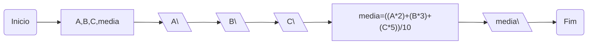

## Q3 flowchart

Faça um programa em java e seu respectivo fluxograman que calcule a media ponderada de 3 números reais (A,B e C) mostre o resultado onde os pesos serão (2,3,5)

------
Média ponderada de 3 valores
------
