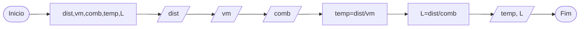

# Q4 Flowchart

Faça um programa em java e seu respectivo fluxograma que leia Três valores: Distancia em km, Velocidade Media e consumo de Combustível de um carro, calcule o tempo de viagem e quantos litros de combustível serão necessários para completar a viagem.

## Quantidade de tempo e combustível para uma viagem

