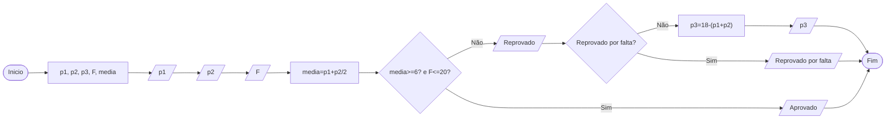

# Q3 Flowchart

Faça um programa em java e seu respectivo fluxograma que dada 2 notas (p1 e p2) e a quantidade de faltas, calcule a media e verifique se a media e maior igual a seis e a quantidade de faltas <= 20 caso verdadeiro mostre aluno aprovado e mostre o valor da media, caso negativo mostre a mensagem aluno reprovado e qual a nota sera necessario tirar para ser aprovado no exame

## Aprovação ou reprovação escolar

