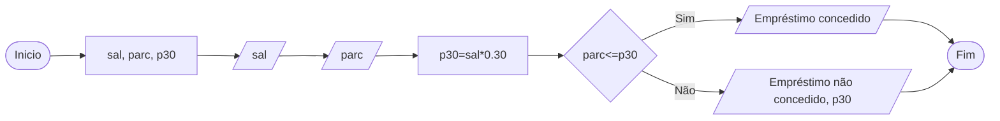

# Q4 Flowchart

Faça um programa em java e seu respectivo fluxograma que dado um salario informado e uma parcela de emprestimo solicitado, calcule 30% do salario, caso o valor da parcela do emprestimo for maior que 30% do salario, mostre a mensagem, emprestimo nao concedido e mostre a margem atual, caso o percentual for menor, mostre a mensagem: emprestimo concedido

## Conceção de empréstimo

