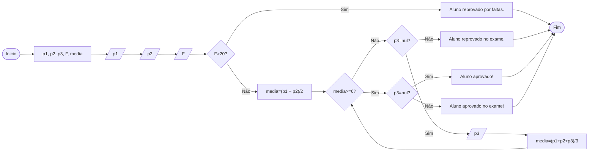

# Q1 Flowchart

Construa um programa em java e seu respectivo fluxograma para o seguinte problema: informada duas notas p1 e p2 e a quantidade de faltas, primeiro identifique se as faltas são maior que 20, caso verdadeiro mostre: aluno reprovado por faltas, caso negativo, calcule a media de p1 e p2 e verifique se a media e maior que 6 caso afirmativo mostre aluno aprovado, caso negativo colete a variável p3 e calcule a media aritmética entre as 3 e verifique novamente se a media recalculada e maior que 6 caso afirmativo mostre, aluno aprovado no exame, caso negativo aluno reprovado no exame

## Aprovação ou reprovação escolar

