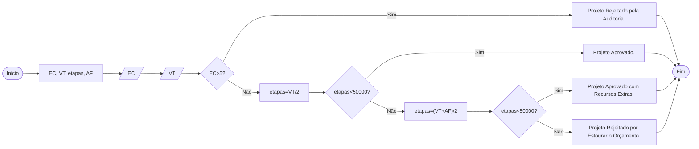

# Q2 Flowchart

Construa um programa em Java e seu respectivo fluxograma para o seguinte problema: Informado o valor total do orçamento de um projeto e a quantidade de erros críticos apontados pela auditoria. Primeiro, identifique se a quantidade de erros críticos é maior que 5; caso verdadeiro, mostre: "Projeto Rejeitado pela Auditoria". Caso negativo, calcule o custo por etapa (dividindo o orçamento pelas 2 etapas iniciais) e verifique se esse custo médio é menor que R$ 50.000,00; caso afirmativo, mostre: "Projeto Aprovado". Caso negativo, colete o valor de um aporte financeiro adicional (terceira variável), recalcule a média do orçamento dividida por 3 etapas e verifique novamente se a nova média é menor que R$ 50.000,00. Caso afirmativo, mostre: "Projeto Aprovado com Recursos Extras"; caso negativo, mostre: "Projeto Rejeitado por Estourar o Orçamento".

## Orçamento para projeto

