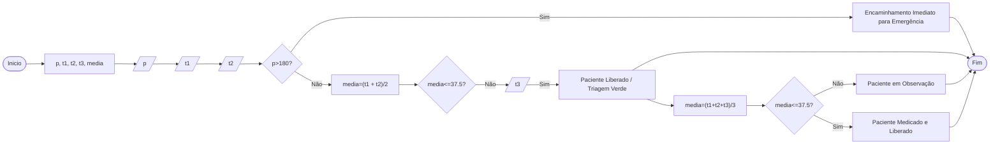

# Q3 Flowchart

Construa um programa em Java e seu respectivo fluxograma para o seguinte problema: Informada a pressão arterial sistólica do paciente e duas medições de temperatura (t1 e t2). Primeiro, identifique se a pressão arterial sistólica é maior que 180 (crise hipertensiva); caso verdadeiro, mostre: "Encaminhamento Imediato para Emergência". Caso negativo, calcule a média das temperaturas t1 e t2 e verifique se a média é menor que 37.5°C; caso afirmativo, mostre: "Paciente Liberado / Triagem Verde". Caso negativo (indicando febre), colete a medição da frequência cardíaca do paciente e calcule a média combinada dos três indicadores clínicos. Verifique se essa nova média passa do limite de alerta estabelecido; caso afirmativo, mostre: "Paciente em Observação"; caso negativo, mostre: "Paciente Medicado e Liberado".

## Triagem de paciente

