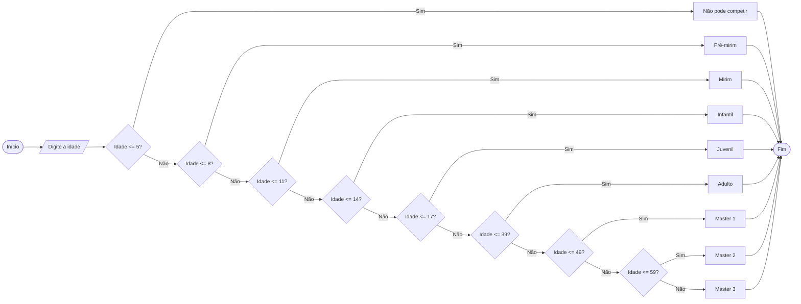

# Q1 Flowchart

Campeonato de Atletismo, Uma escola de atletismo deseja inscrever seus alunos em uma competição. Para definir a categoria de cada atleta, o programa deverá receber a idade do aluno.

As categorias são:
De 0 a 5 anos: não pode competir
De 6 a 8 anos: Pré-mirim
De 9 a 11 anos: Mirim
De 12 a 14 anos: Infantil
De 15 a 17 anos: Juvenil
De 18 a 39 anos: Adulto
De 40 a 49 anos: Master 1
De 50 a 59 anos: Master 2
60 anos ou mais: Master 3

O programa deverá informar a categoria do atleta ou informar que ele não pode competir.

## Campeonato de atletismo

