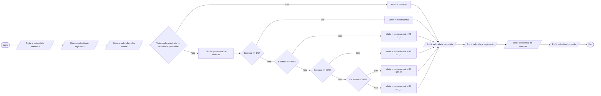

# Q2 Flowchart

Cálculo de multa por excesso de velocidade
Uma empresa de trânsito deseja desenvolver um algoritmo para calcular a multa de um motorista que ultrapassou a velocidade máxima permitida em uma determinada via.

O programa deverá receber:
A velocidade máxima permitida na via, em km/h;
A velocidade registrada pelo radar, em km/h;
O valor da multa normal, em reais.

Primeiramente, o programa deverá calcular qual foi o percentual de excesso de velocidade cometido pelo motorista.
A multa será calculada de acordo com as seguintes faixas:

Até 5% acima da velocidade permitida → multa normal;
Acima de 5% até 10% → multa normal + R$ 100,00;
Acima de 10% até 20% → multa normal + R$ 200,00;
Acima de 20% até 30% → multa normal + R$ 300,00;
Acima de 30% → multa normal + R$ 500,00.

Caso a velocidade registrada seja igual ou inferior à velocidade permitida, o motorista não receberá multa.

Ao final, o programa deverá informar:
A velocidade permitida;
A velocidade registrada;
O percentual de excesso de velocidade;
O valor final da multa.

## Multa por excesso de velocidade

