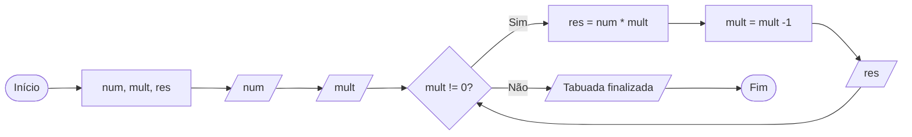

# Q1 Flowchart

Crie um metodo, que receba um parametro inteiro e mostre o resultado da tabuada do numero informado usando um laço faça ate.

## Resultado da tabuada

```mermaid
graph LR
        A([Início]) --> B[num, mult, res]
        B --> C[/num/]
        C --> D[/mult/]
        D --> E{mult != 0?}

        E -- Sim --> F[res = num * mult]
        F --> G[mult = mult -1]
        G --> H[/res/]
        H --> E

        E -- Não --> I[/Tabuada finalizada/]
        I --> J([Fim])
```
