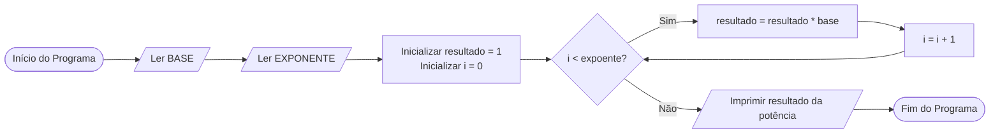

# Q4 Flowchart

Crie uma função que receba dois numeros inteiros, BASE e EXPONENTE e retorne o valor da potencia do numero exemplo 2 elevado a 3 = 8

## Potencia de um número

```mermaid
graph LR
    Start([Início do Programa]) --> InputBase[/Ler BASE/]
    InputBase --> InputExp[/Ler EXPONENTE/]
    

    InputExp --> Init[Inicializar resultado = 1 <br> Inicializar i = 0]
    

    Init --> LoopDec{i < expoente?}
    

    LoopDec -- Sim --> Calc[resultado = resultado * base]
    Calc --> Inc[i = i + 1]
    Inc --> LoopDec
    

    LoopDec -- Não --> Output[/Imprimir resultado da potência/]
    Output --> End([Fim do Programa])
```

