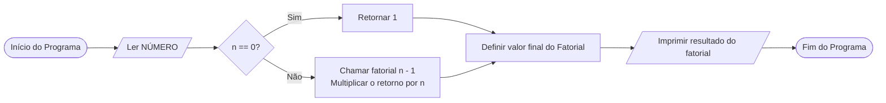

# Q5 Flowchart

Crie uma função que receba um numero, calcule e retorne o fatorial do numero informado: exemplo Fatorial de 3 = 6

## Calculo de Fatorial

```mermaid
graph LR
    Start([Início do Programa]) --> Input[/Ler NÚMERO/]
    Input --> CheckZero{n == 0?}

    CheckZero -- Sim --> BaseCase[Retornar 1]

    CheckZero -- Não --> Recurse[Chamar fatorial n - 1 <br> Multiplicar o retorno por n]

    BaseCase --> Combine[Definir valor final do Fatorial]
    Recurse --> Combine

    Combine --> Output[/Imprimir resultado do fatorial/]
    Output --> End([Fim do Programa])

```
